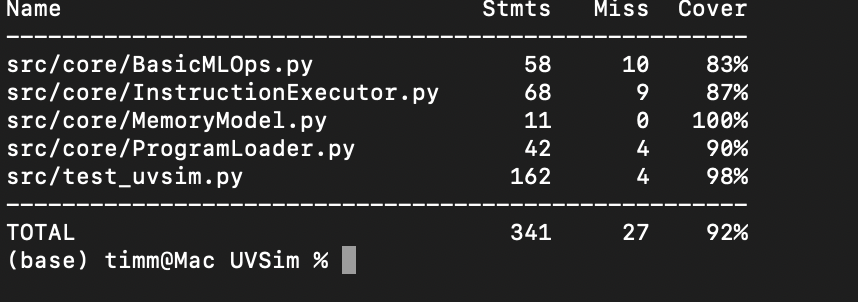

# CS2450 Group 3 - UVSim  

**Utah Valley University**  
**Professor Qudrat E Alahy Ratul**  
**Class:** Computer Science 2450 - Software Engineering I  

### Team Members  

- Taylor Oldham
- Nathaniel Wilson
- Timothy Faupusa  
---

### Table of Contents
- <a href="https://github.com/G3-2450/UVSim/blob/main/README.md#description-and-project-overview">Description and Project Overview</a>
- <a href="https://github.com/G3-2450/UVSim/blob/main/README.md#program-demo">Program Demo</a>
- <a href="https://github.com/G3-2450/UVSim/blob/main/README.md#dependancies--prerequisites">Dependencies & Prerequisites</a>
- <a href="https://github.com/G3-2450/UVSim/blob/main/README.md#installation--running-uvsim-gui">Installation and Running UVSim</a>
- <a href="https://github.com/G3-2450/UVSim/blob/main/README.md#features">Features</a>
- <a href="https://github.com/G3-2450/UVSim/blob/main/README.md#uvsim-instruction-set-opcodes">UVSim Instruction Set Opcodes</a>
- <a href="https://github.com/G3-2450/UVSim/blob/main/README.md#class--architecture-diagrams">Class & Architecture Diagrams</a>
- <a href="https://github.com/G3-2450/UVSim/blob/main/README.md#final-srs-document">Final SRS Document</a>
- <a href="https://github.com/G3-2450/UVSim/blob/main/README.md#testing">Testing</a>
- <a href="https://github.com/G3-2450/UVSim/blob/main/README.md#known-issues--future-work">Known Issues/Future Work</a>
- <a href="https://github.com/G3-2450/UVSim/blob/main/README.md#technology-used">Technology Used</a>
- <a href="https://github.com/G3-2450/UVSim/blob/main/README.md#project-timeline-sprints--scrum-master-schedule">Prooject Timeline</a>
- <a href="https://github.com/G3-2450/UVSim/blob/main/README.md#final-retrospective-summary">Retrospective Summary</a>

### Description and Project Overview

UVSim (Utah Valley Simulator) is a **machine-level simulator** designed for CS2450 to help students understand how memory, registers, and low-level instruction execution works.  

The simulator emulates a simplified **BasicML (Basic Machine Language)** system with:  
- A **memory of 250 words** (6-digit signed integers)  
- An **accumulator** and **program counter**  
- **BasicML instructions** for I/O, arithmetic, load/store, and branching

The goal is to give students a hands-on experience with **machine language execution**, **instruction stepping**, and **memory visualization** in a GUI interface.

---

## Program Demo

**GUI Screenshot:**  
  

**Final Presentation Slides:**  
[Click to view slides](https://github.com/G3-2450/UVSim/blob/15d73cbaa22955383965b6b795f56c41b89ee86c/docs/Final-Submission/CS2450%20Final%20Group%20Presentation%20(1).pdf)

---

### Dependancies & Prerequisites
- Python 3
- Kivy (Insall with 'pip install kivy')

### Installation & Running UVSim (GUI)
- In the console, navigate to the interface folder ('cd src/interface')
- Run `python3 .\gui.py
- This will run the UVSim GUI.

---

### Features
- **File Upload:** Load one or multiple `.txt` files with BasicML instructions  
- **Run Program:** Execute the program in memory until HALT  
- **Step Execution:** Execute one instruction at a time for teaching/demo purposes  
- **Memory & Register Display:** View 250 memory locations, accumulator, and program counter  
- **Console Output:** See program output and prompts for input directly in the GUI  
- **Theme Toggle:** Switch between dark mode and light mode  
- **Error Handling:** Gracefully handles errors and invalid input from the user

### UVSim Instruction Set Opcodes
- **I/O Operations**
  - READ = 010        Read value from keyoboard into a specific memory location.   
  - WRITE = 011       Write value from a specific memory location to the screen.
- **Load/Store Operations**    
  - LOAD = 020        Load value from a specific memory location to the accumulator.  
  - STORE = 021       Store value from the accumulator to a specific memory location.   
- **Arithmetic Operations**
  - ADD = 030         Add value from a specific memory location to the value in the accumulator.  
  - SUBTRACT = 031    Subtract value from a specific memory location from the value in the accumulator.  
  - DIVIDE = 032      Divide the value in the accumulator by the value in a specific memory location.  
  - MULTIPLY = 033    Multiply the value in the accumulator by the value in a specific memory location. 
- **Control/Flow Operations** 
  - BRANCH = 040      Branch to a specific memory location.  
  - BRANCHNEG = 041   Branch to a specific memory location if the value in the accumulator is negative.  
  - BRANCHZERO = 042  Branch to a specific memory location if the value in the accumulator is zero.  
  - HALT = 043        Stop the program.  

---

### Class & Architecture Diagrams

**Class Diagram UML:**  
.png)

---

### Final SRS Document

**User Stories/Use Cases**

**Functional Specifications**

[srs.md](https://github.com/G3-2450/UVSim/blob/bd88fe4a44f97645f5edb43e8041bccfa9a390c6/docs/Final-Submission/srs.md)

---

### Testing

**Testing Coverage Report:**  
  

**Program Tests:**  
[Click to view slides](https://github.com/G3-2450/UVSim/tree/15d73cbaa22955383965b6b795f56c41b89ee86c/tests)

--- 

### Known Issues / Future Work
- File upload requires .txt format only
- Future Enhancements:
  - Improved error popups in GUI
  - Multi-file program chaining 
  - Export console output to file
  - Additional color scheme options

--- 

### Technology Used  
- **Front End:** Python GUI - KIVY
- **Back End:** Python   
- **Tools/Project Management:**
  - Zenhub: https://shorturl.at/1RH8Z
---

### Project Timeline (Sprints & Scrum Master Schedule)  

##### Milestone 2:
- **Deadline:** June 16th, 2025
- **Scrum Master:** Taylor
- **Scribe:** Tim

##### Milestone 3:
- **Deadline:** June 30th, 2025
- **Scrum Master:** Tim
- **Scribe:** Nathaniel

##### Milestone 4:
- **Deadline:** July 14th, 2025
- **Scrum Master:** Nathaniel
- **Scribe:** Taylor

##### Milestone 5:
- **Deadline:** July 28th
- **Scrum Master:** Taylor
- **Scribe:** Tim

---

**Zenhub (integrated into Github):**
https://shorturl.at/1RH8Z

---

### Final Retrospective Summary

[Retrospective Summary](https://github.com/G3-2450/UVSim/blob/26b67663bafef030850c9a56b0f76bed161adfa1/docs/Final-Submission/Retrospective.md)

---
